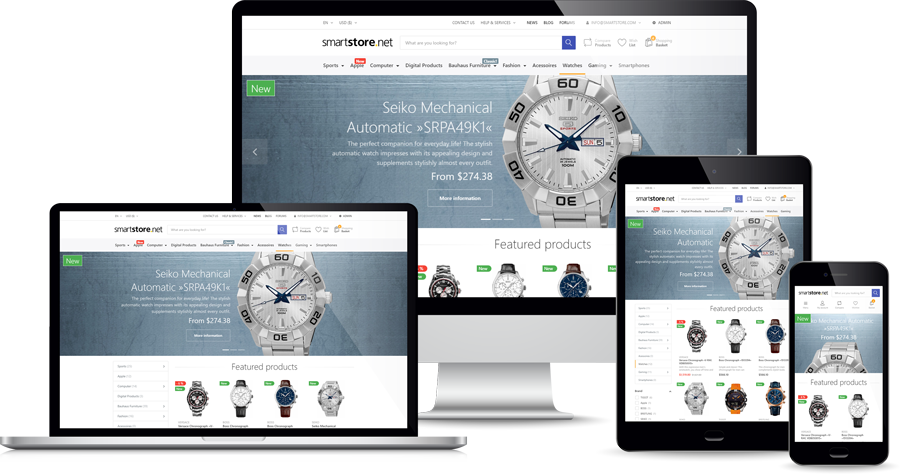
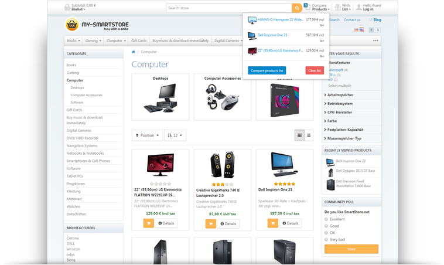

## Overview

  

## Highlights

### Technology & Design

* Easy to extend and extremely flexible thanks to modular design
* Highly scalable thanks to full page caching and web farm support 
* A powerful theming engine lets you create themes & skins with minimum effort thanks to theme inheritance
* Point&Click Theme configuration
* Highly professional search framework based on Lucene.NET, delivering ultra fast faceted search results
* Easy shop management thanks to modern and clean UI

### Features

* NEW: CMS Page Builder
* NEW: CMS Menu Builder
* Multi-Store support
* Unlimited number of products and categories
* Product Bundles
* RESTful WebApi
* Multi-language and RTL support
* Modern, clean, SEO-optimized and fully responsive Theme based on Bootstrap 4
* Ultra fast search framework with faceted search support
* Extremely scalable thanks to output caching, REDIS & Microsoft Azure support.
* Trusted Shops precertification
* 100% compliant with German jurisdiction
* Sales-, Customer- & Inventory-management
* Comprehensive CRM features
* Powerful Discount System
* Powerful layered navigation in the shop
* Numerous Payment and Shipping Providers and options
* Sophisticated Marketing & Promotion capabilities (Gift cards, Reward Points, discounts of any type and more)
* Reviews & Ratings
* CMS (Blog, Forum, custom pages & HTML content etc.)
* and many more...
